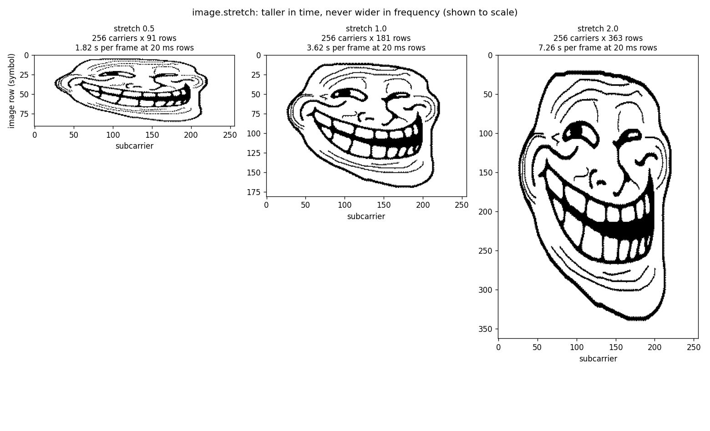
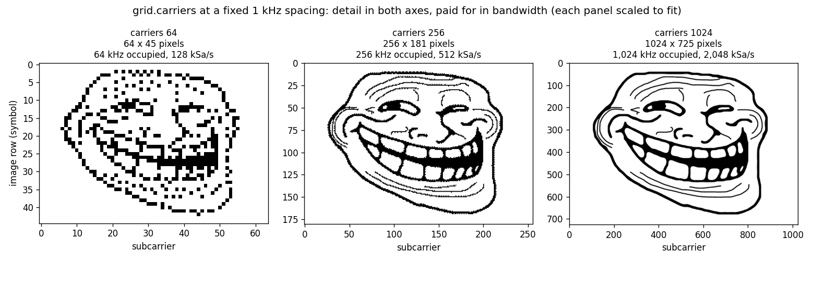
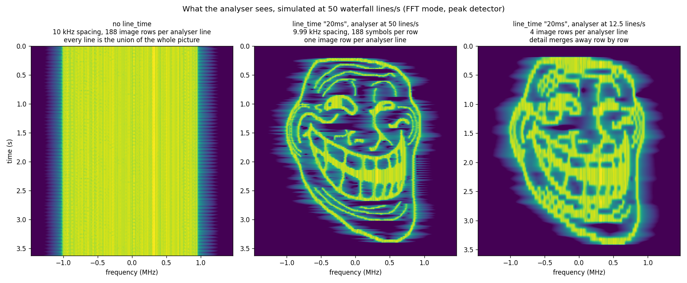
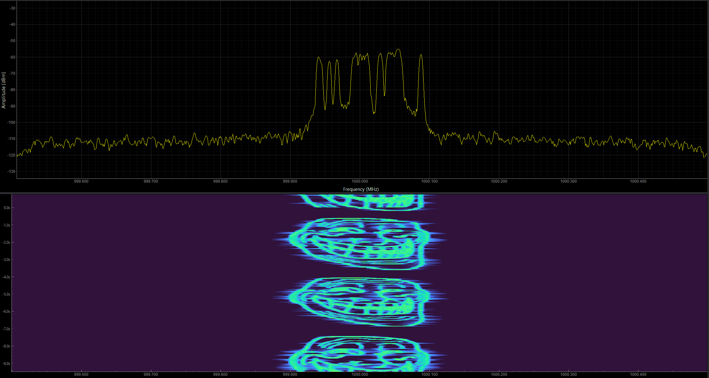

# bitfall

> # ⚠️ THIS PROJECT WAS ENTIRELY VIBECODED
> This was the premise of this experiment: that I do not write a single line of code
>
> It was however tested on actual hardware

## Purpose

Encode a 1-bit image into a complex-baseband OFDM waveform. Transmit it, and the
picture appears on a spectrum analyser's waterfall.

```
python bitfall.py config.waterfall.json
```

Each **row** of the image becomes one OFDM symbol. Each **column** becomes one
subcarrier. A black pixel switches that subcarrier on; a white pixel leaves it
off. Symbols are built with a complex IFFT, given a cyclic prefix, windowed and
overlap-added, exactly as a real OFDM transmitter would — so the result is a
well-behaved signal with a defined occupied bandwidth.

All configuration is JSON.

```
python bitfall.py config.json                  # generate
python bitfall.py --write-template config.json # starter config
python bitfall.py config.json --print-config   # resolved config, then exit
```

## Requirements

- Python 3.12+
- numpy 2.4.4
- pillow 12.2.0
- matplotlib 3.10.8 (optional, only needed for `diagnostics.plot`)
- markdown 3.10.3 (optional, only needed to generate html from md file)

---

## Configuration

Four sections: `image`, `grid`, `output`, `diagnostics`. Unknown keys are a hard
error rather than a silent default, because a typo would otherwise produce a
plausible but wrong waveform.

Numbers accept SI strings where marked: frequencies as `10000`, `1e4`, `"10k"`,
`"2.5M"`, `"2.45G"`; times as `0.02`, `"20ms"`, `"20000us"`, `"2e-2 s"`. A bare
number means Hz or seconds respectively.

### `image`

| key | default | meaning |
|---|---|---|
| `path` | *required* | source image; any format Pillow reads. Transparency is composited onto white. |
| `dither` | `true` | Floyd–Steinberg down to 1 bit. Set `false` to use `threshold` instead. |
| `threshold` | `null` | 0–255 cut point when `dither` is false. `null` means 128. |
| `invert` | `false` | swap ON and OFF, i.e. transmit white pixels instead of black. |
| `transpose` | `false` | rotate 90° first, for displays that scroll sideways instead of down. |
| `flip_time` | `false` | send the last image row first. |
| `stretch` | `1.0` | scale the row count (see below). |
| `max_symbols` | `null` | cap the row count. Resamples to fit, it does not crop. |
| `silence` | `0` | append this many blank rows after the picture. |

The column count is pinned by `grid.carriers`, so the row count is whatever the
aspect ratio asks for. `stretch` scales just that — the picture gets taller in
time without getting wider in frequency, which is how we adjust for a waterfall
whose axes are not to scale.



Above 1 it resamples from the source, so real detail survives up to the source
height (`images/umad.png` is 376 px tall, so `stretch 2.0` is still genuine detail, not
interpolation). Below 1 it squashes. `max_symbols` still applies afterwards.

`stretch` and `line_time` both make the picture taller on the waterfall and cost
the same in frame time and file size. The difference is what fills the extra
height: `stretch` adds resampled rows, `line_time` makes each existing row a
thicker band. Use `stretch` while there is source resolution to spend, then
`line_time`.

`silence` appends blank rows after the last image row: every subcarrier OFF,
so the waterfall shows dead air for `silence` x `line_time`. On a looping ARB
that is the gap between one copy of the picture and the next, which stops the
loop reading as one continuous image and gives the eye a reference to measure
the line rate against. The rows are added after `flip_time`, so the gap is
always at the end in time, and they are not counted against `max_symbols`.

Dither versus threshold barely matters for line art — with a source that is
already essentially 1-bit, the two produce nearly the same grid. It matters for
photographs, where `dither` renders tone as ON-density and a hard threshold
throws it away.

### `grid`

| key | default | meaning |
|---|---|---|
| `carriers` | `256` | active subcarriers = image width in pixels. Power of two. |
| `fft_size` | `2 × carriers` | IFFT length. Power of two, at least `carriers` (`carriers + 1` if `null_dc`). The excess is guard band. |
| `subcarrier_spacing` | `"10k"` | Hz between carriers. Sets bandwidth and symbol time. |
| `line_time` | `null` | target duration of one image row. Derives `symbol_repeat` and nudges the spacing. |
| `symbol_repeat` | `null` | symbols per image row, set manually. Mutually exclusive with `line_time`. |
| `cyclic_prefix` | `0.0625` | CP length as a fraction of `fft_size`. |
| `window` | `0.03` | raised-cosine ramp as a fraction of `fft_size`, clamped to the CP. Keeps spectral regrowth down at symbol boundaries. |
| `null_dc` | `true` | skip the centre bin so LO leakage and DC offset do not land on a pixel column. |
| `phase_seed` | `1234` | seed for the fixed per-subcarrier phases. Random phases keep the crest factor to a few dB instead of an impulse; fixed ones keep every carrier phase-continuous from symbol to symbol. |

Everything else follows from these:

```
sample rate      fs = fft_size × subcarrier_spacing
occupied BW         = carriers × subcarrier_spacing
symbol time      Ts = (fft_size + CP) / fs  ≈  (1 + cyclic_prefix) / subcarrier_spacing
row time            = symbol_repeat × Ts
lines per second    = 1 / row time
```

`carriers` buys detail in both axes at once — the row count follows the aspect
ratio — the downside is an increase in occupied bandwidth and sample rate:



64 carriers is too coarse for this picture; 256 is comfortable; 1024 is sharp but
wants 1 MHz of spectrum and a 2 MSa/s ARB clock at the same 1 kHz spacing.

### `output`

| key | default | meaning |
|---|---|---|
| `path` | *image path with the format's suffix* | output file. |
| `format` | `"cf32"` | one of `cf32`, `ci16`, `ci8`, `csv`, `wv`. |
| `peak` | `0.95` | peak magnitude after normalisation, 0–1. |
| `csv_precision` | `6` | significant digits, `csv` only. 1–17. |
| `clip_papr_db` | `null` | iterative clip-and-filter to this crest factor. |
| `centre_frequency` | `0` | recorded in the SigMF sidecar only. It does **not** shift the baseband. |
| `sigmf` | `true` | write a `.sigmf-meta` sidecar. Skipped for `csv` and `wv`, which are not bare IQ streams. |
| `marker` | `false` | `.wv` only: add a control list with a marker pulse at the top of the image. |

| format | container | notes |
|---|---|---|
| `cf32` | float32 I,Q | GNU Radio `.cfile`, SoapySDR, UHD |
| `ci16` | int16 I,Q | PlutoSDR, USRP sc16, bladeRF |
| `ci8` | int8 I,Q | HackRF |
| `csv` | text | one `i,q` line per sample, no header |
| `wv` | R&S ARB | tagged int16, for Rohde & Schwarz generators |

**PAPR:** OFDM with hundreds of carriers has a high crest factor — the waveform described above (taken from `config.example.json`)
measures 12.99 dB raw. `clip_papr_db` trades EVM for headroom with four rounds of
clip-and-refilter, re-nulling the out-of-band bins each round so the occupied
bandwidth stays clean. Set it to whatever the transmitter PA can take; leave it `null` if the
generator has the headroom, since clipping is not free.

**Marker:** With `"marker": true` the `.wv` header gains:

```
{CONTROL LENGTH: 1870831}{MARKER LIST 1: 0:1;10336:0}
```

Marker 1 goes high for exactly the first image row. Feed the generator's marker
output to the analyser's external trigger and every acquisition starts at the top
of the picture, so the waterfall stops rolling and the vertical scale stops
drifting. Without it the picture is still readable, just never still. Check the
tag syntax against the instrument's manual — this follows the R&S reference
writer's conventions.

### `diagnostics`

| key | default | meaning |
|---|---|---|
| `plot` | `null` | three-panel PNG: original, transmitted grid, simulated waterfall. Needs matplotlib. |
| `plot_dpi` | `130` | |
| `plot_dynamic_range` | `60.0` | dB below peak shown in the waterfall panel. |
| `bitmap` | `null` | save the 1-bit grid that is actually transmitted, as a PNG. |
| `verify` | `false` | demodulate the generated IQ and report round-trip BER. Should be 0.0000%. |

`verify` is cheap and worth leaving on. A non-zero BER means the grid and the
waveform disagree — a real bug, not a tolerance.

## Making sure the image can be visualised on a waterfall

While the waveform generated would be technically correct, we would not be able to see anything
without altering it:

A spectrum analyser paints somewhere around 10–50 waterfall lines per second.
Left to itself, this tool emits image rows at the OFDM symbol rate — with the configuration of `config.example.json`, about
**9,400 rows per second** at the default 10 kHz spacing. Every analyser line
therefore integrates hundreds of image rows and shows their union, which ends up just showing a
solid band.



We have to "slow down" the image by duplicating the lines, thereby giving time to the analyser to display it.
We use the parameter `grid.line_time`. User states how long one image row should last, and the
tool holds each row over as many symbols as that takes:

```json
"grid": { "carriers": 256, "subcarrier_spacing": "1k", "line_time": "20ms" }
```

From the example of `config.example.json` that grid, with everything else left at its default, prints:

```
subcarrier space : 1,009.4 Hz          (nudged from the 1 kHz originally requested)
sample rate      : 516,800.0 Sa/s
occupied BW      : 258,400.0 Hz
symbols per row  : 19
row (line) time  : 20.000 ms  -> 50.00 lines/s
samples          : 1,870,831  (3,620.0 ms, 7.48 MB wv)
```

It solves for the repeat count, then nudges the subcarrier spacing so that
`repeat` symbols last exactly `line_time`. The nudge is under half a symbol in
`repeat`, so the occupied bandwidth lands within about `1/(2·repeat)` of what the user
asked for — 1,009.4 Hz instead of 1,000 Hz above.

### Why one symbol per row can never work

An analyser needs a dwell of at least `1/subcarrier_spacing` to resolve the
subcarriers from one another, and a dwell of at most one row to keep the rows
separate. Those two bounds give a margin of

```
row time × subcarrier_spacing  =  symbol_repeat × (1 + cyclic_prefix)
```

At `symbol_repeat` 1 that margin is **1.06** — a 6% window, which no analyser can
land in once we allow for processing overhead. At 19 it is **20×**. That is the
whole trick, and it is why no amount of fiddling with analyser settings rescues a
waveform generated without `line_time`.

### Matching the analyser

Set the analyser's per-line acquisition time equal to `line_time`. The rightmost
panel above is the same waveform read four times too slowly: the failure is
gradual, not a cliff, so being somewhat fast is safe and being slow costs detail.

One caveat for wide signals. A **swept** measurement needs roughly `span / RBW²`
per sweep — at a 3 MHz span and 10 kHz RBW that is about 30 ms, already past a
20 ms row. In **FFT / IQ / realtime** mode acquisition is about `1/RBW` (100 µs),
so 20 ms rows have enormous headroom. Modern analysers default to FFT sweeps at
narrow RBW.

---

## Composing configs

`extends` merges a child over a parent, section by section. Paths resolve
relative to the child. Chains are followed; cycles are rejected.

```json
{
  "extends": "config.example.json",
  "grid":   { "subcarrier_spacing": "1k", "line_time": "20ms" },
  "output": { "path": "out/waterfall.wv", "marker": true }
}
```

`jobs` runs a batch, each entry merged over the shared settings — useful for
sweeping one parameter:

```json
{
  "extends": "config.example.json",
  "jobs": [
    { "grid": { "line_time": "10ms" }, "output": { "path": "out/fast.wv" } },
    { "grid": { "line_time": "50ms" }, "output": { "path": "out/slow.wv" } }
  ]
}
```

---

## Example configs

**`config.example.json` (1st column)** — every key written out at its default, 256 carriers at
10 kHz spacing, no `line_time`. Useful as a reference for what the tool accepts,
and fine for feeding a receiver or a recording. It will **not** show a picture on
a waterfall: at 9,412 rows per second the whole image flashes past in 19.2 ms.

**`config.waterfall.json` (2nd column)** — the one to transmit to visualise on a waterfall. It extends the example and
overrides what matters: 1 kHz spacing, 20 ms rows, `stretch` 2.0, marker on.

| | Base example | Extended for waterfall - scs 1 kHz | Extended for waterfall - scs 10 kHz |
|---|---|---|---|
| `carriers` / `fft_size` | 256 / 512 | 256 / 512 | 256 / 512 |
| `subcarrier_spacing` | `"10k"` | `"1k"` | `"10k"` |
| `line_time` | — | `"20ms"` | `"20ms"` |
| `stretch` | 1.0 | 2.0 | 2.0 |
| actual spacing | 10 kHz | 1,009.4 Hz | 9,987.5 Hz |
| symbols per row | 1 | 19 | 188 |
| image rows | 181 | 363 | 363 |
| sample rate | 5.12 MSa/s | 516.8 kSa/s | 5.1136 MSa/s |
| occupied BW | 2.56 MHz | 258.4 kHz | 2.5568 MHz |
| lines/s | 9,412 | 50 | 50 |
| frame duration | 19.2 ms | 7.26 s | 7.26 s |
| file (`wv`) | 0.4 MB | 15.0 MB | 148.5 MB |
| waterfall? | no | yes | yes, at a price |

The third column is `config.waterfall.json` with `subcarrier_spacing` put back to
`"10k"`. It keeps a realistic 2.56 MHz occupied bandwidth, but the repeat jumps
from 19 to 188 and the file goes with it — roughly 10x, for the same picture at
the same line rate. Widening the band is paid for entirely in file size, and a
2.56 MHz span with a 20 ms row leaves a swept analyser no margin.

Past a 64x repeat the tool prints a warning naming the spacing that would reach
the same line rate for free. It counts repeats rather than bytes, so read it
alongside the reported file size before deciding whether it matters.

---

## Analyser setup recommendations

- **Span** ≈ 1.2–1.5 × occupied bandwidth
- **RBW** ≤ `subcarrier_spacing`
- **Sweep / frame time per line** = `line_time`
- **Detector** max peak or sample — *not* RMS or average
- **Trace** clear/write, averaging off
- **Sweep mode** FFT rather than swept, if there is a choice
- **Trigger** external, from the generator's marker output, if `marker` was used

---

## Troubleshooting

**Flat block, no picture.** No `line_time`, or the analyser's line rate does not
match it. This is the common case — see the top of this file.

**Picture rolls or breathes vertically.** Free-running acquisition. Set
`"marker": true` and trigger the analyser externally.

**Picture is squashed or stretched.** The waterfall's axes are not to scale.
Correct it with `image.stretch`.

**UNCAL on the analyser.** Swept mode cannot complete a sweep inside `line_time`.
Raise `line_time`, narrow the span, or switch to FFT sweeps.

**A permanent bright line down the centre.** `null_dc` is `false`, so a pixel
column sits on the DC bin, where LO leakage and the generator's DC offset land.
Leave it `true`.

**Round-trip BER is not zero.** A genuine bug — the transmitted grid and the
waveform disagree. Please report it with the config.

**File too large for the ARB.** The repeat multiplies the waveform. Lower
`subcarrier_spacing` until the symbol time is close to the desired row time, and
let the repeat cover only the remainder.

---

## Regenerating the figures of this document

```
python docs/make_figures.py
```

The figures are built by calling into `bitfall.py` itself, so they cannot drift
away from what the tool actually produces. `docs/line_time.png` additionally
simulates an analyser in FFT mode with a peak detector — one waterfall line per
acquisition window, every FFT inside that window folded in with a max — which is
precisely why a window holding many symbols shows their union.

## Hardware test

Real life test: waveform being transmitted from an R&S signal generator,
and received by a Pluto SDR (LibreSDR):



Using the waveform described in "Extended example - scs 1 kHz" generated
using `config.waterfall.json`, which is the default example present in the repo (~15MB waveform)